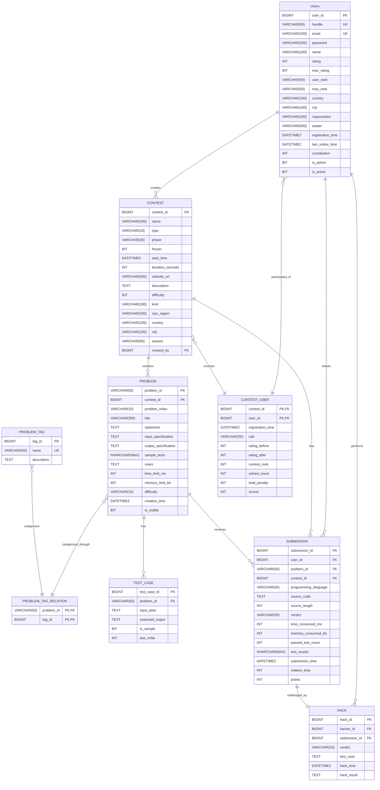

# 数据库原理大作业 - 在线判题系统 (OJ)

> 数据库原理实验：课程考核是分小组完成一个数据库设计大作业，每个小组2人，需要从选题、需求分析开始分阶段完成一个数据库应用程序的设计与实现，课程结束需要进行演示答辩并提交设计报告和源程序。课程设计大作业占总成绩的70%，过程考核（实验作业、考勤和课堂表现）占总成绩的30%。

## 📋 项目简介

这是一个基于 **Codeforces** 平台功能设计的在线判题系统（OJ），使用 **Microsoft SQL Server** 作为数据库，**Python Flask** 作为后端框架，前端采用原生 HTML/../static/css/JavaScript 实现。

## 🏗️ 系统架构

### 技术栈

- **后端**: Python Flask + pyodbc
- **数据库**: Microsoft SQL Server
- **前端**: HTML5 + CSS3 + JavaScript (原生)
- **认证**: Windows 身份验证

### 核心功能

- ✅ 用户注册与登录系统
- ✅ 题目浏览与提交
- ✅ 代码评测（模拟评测）
- ✅ 比赛管理
- ✅ 用户排名系统
- ✅ 管理员功能（题目/比赛创建）

## 📁 项目结构

``` txt
Database-Principles-Major-Assignment/
├── app.py                    # Flask 主应用
├── codeforces_crawler.py     # Codeforces 数据爬虫
├── config.py                 # 数据库配置
├── requirements.txt          # Python 依赖
├── README.md                 # 项目说明文档
├── app_pkg/                  # 应用包目录
│   └── routes/               # 路由模块
├── database/                 # 数据库相关文件
│   ├── create.sql           # 数据库表结构创建脚本
│   ├── import.sql           # 数据导入脚本
│   ├── view.sql             # 视图创建脚本
│   ├── create_admin.sql     # 管理员创建脚本
│   ├── tmp.sql              # 临时SQL脚本
│   └── E-R图/               # 数据库设计图
│       ├── E-R图.mermaid    # Mermaid格式E-R图
│       └── E-R图.png        # E-R图图片
├── docs/                    # 项目文档
│   ├── 功能实现.md          # 功能说明文档
│   ├── 后端开发手册.md      # 后端开发指南
│   ├── 前端开发手册.md      # 前端开发指南
│   └── 数据库结构概览.md    # 数据库结构说明
├── routes/                  # 路由处理模块
│   ├── __init__.py          # 路由包初始化文件
│   ├── auth.py              # 认证路由
│   ├── contests.py          # 比赛路由
│   ├── hacks.py             # Hack路由
│   ├── problems.py          # 题目路由
│   ├── submissions.py       # 提交路由
│   └── users.py             # 用户路由
├── static/                  # 静态资源文件
│   └── img1.jpg             # 静态图片资源
├── templates/               # HTML 模板文件
│   ├── index.html           # 首页
│   ├── problems.html        # 题目列表页
│   ├── problem_detail.html  # 题目详情页
│   ├── contests.html        # 比赛列表页
│   ├── contest_detail.html  # 比赛详情页
│   ├── contest_standings.html # 比赛排名页
│   ├── submissions.html     # 提交记录页
│   ├── users.html           # 用户列表页
│   ├── profile.html         # 用户个人资料页
│   ├── create_problem.html  # 题目创建页
│   ├── create_contest.html  # 比赛创建页
│   ├── submission_detail.html # 提交详情页
│   ├── hacks.html           # Hack列表页
│   ├── hack_submissions.html # Hack提交页
│   └── index_loger.html     # 登录页
└── utils/                   # 工具模块
    ├── __init__.py          # 工具包初始化文件
    └── database.py          # 数据库工具函数
```

## 🗄️ 数据库设计

### 主要数据表

#### 1. **用户表 (Users)**

- 用户ID、用户名、邮箱、密码
- 评分信息：当前评分、最高评分、等级
- 个人信息：国家、城市、组织、头像
- 活跃信息：注册时间、最后在线时间、贡献值
- 权限控制：管理员标识、活跃状态

#### 2. **比赛表 (CONTEST)**

- 比赛ID、名称、类型（CF/IOI/ICPC）、阶段
- 时间信息：开始时间、持续时间
- 描述信息：网址、描述、难度、类型、ICPC区域
- 创建者外键关联用户

#### 3. **题目表 (PROBLEM)**

- 题目ID（唯一）、所属比赛、题目索引
- 题目内容：标题、描述、输入输出规范、样例
- 限制条件：时间限制、内存限制
- 统计信息：通过数、提交数、难度
- 可见性控制

#### 4. **题目标签系统**

- `PROBLEM_TAG`：标签字典表
- `PROBLEM_TAG_RELATION`：题目与标签的多对多关系表

#### 5. **测试用例表 (TEST_CASE)**

- 输入数据、期望输出
- 标记是否为样例、测试顺序

#### 6. **提交表 (SUBMISSION)**

- 提交ID、用户ID、题目ID、比赛ID
- 编程语言、源代码、代码长度
- 判题结果：状态、耗时、内存使用
- 通过测试数、详细测试结果、提交时间

#### 7. **比赛用户关系表 (CONTEST_USER)**

- 用户在比赛中的角色
- 比赛前后的评分变化
- 比赛排名、解题数、罚分、得分

#### 8. **Hack表 (HACK)**

- Hack者、被Hack者、题目、比赛
- Hack结果、使用的测试用例、Hack时间

### E-R 图



## 🚀 快速开始

### 环境要求

- Python 3.7+
- Microsoft SQL Server
- Windows 操作系统（支持 Windows 身份验证）
- 推荐使用 Visual Studio Code 进行开发

### 安装步骤

1. **克隆项目**

   ```bash
   git clone <repository-url>
   cd Database-Principles-Major-Assignment
   ```

2. **安装 Python 依赖**

   ```bash
   pip install -r requirements.txt
   ```

3. **配置数据库连接**

   - 确保 SQL Server 服务正在运行
   - 修改 `config.py` 中的数据库配置：

   ```python
   DB_SERVER = 'localhost'  # 或您的 SQL Server 实例名
   DB_NAME = 'OJ'           # 数据库名称
   ```

4. **创建数据库结构**
   - 在 SQL Server 中创建名为 `OJ` 的数据库
   - 按顺序执行以下 SQL 脚本：

     ```sql
     -- 1. 创建表结构
     database/create.sql
     
     -- 2. 创建视图
     database/view.sql
     
     -- 3. 创建管理员账户
     database/create_admin.sql
     
     -- 4. 导入示例数据（可选）
     database/import.sql
     ```

5. **数据爬取（可选）**
   - 如果需要从 Codeforces 获取真实数据，可以运行：

   ```bash
   python codeforces_crawler.py
   ```

6. **启动应用**

   ```bash
   python app.py
   ```

7. **访问系统**
   打开浏览器访问：`http://localhost:5000`

### 默认管理员账号

系统已通过 `database/create_admin.sql` 脚本创建默认管理员账户：

- 用户名：`admin`
- 密码：`admin123`
- 邮箱：`admin@example.com`

### 开发模式

如需在开发模式下运行，可以设置环境变量：

```bash
set FLASK_ENV=development
python app.py
```

## 🔧 功能特性

### 用户功能

- [x] 用户注册与登录
- [x] 个人信息管理
- [x] 密码修改
- [x] 题目浏览与搜索
- [x] 代码提交与评测
- [x] 提交记录查看
- [x] 比赛参与
- [x] 排名查看

### 管理员功能

- [x] 题目创建与管理
- [x] 比赛创建与管理
- [x] 用户权限管理
- [x] 系统数据管理

### 评测系统

- [x] 多语言支持
- [x] 模拟评测（随机结果）
- [x] 详细的评测信息
- [x] 测试用例管理

## 📊 API 接口

### 用户认证相关

- `POST /api/register` - 用户注册
- `POST /api/login` - 用户登录
- `GET /api/logout` - 用户登出
- `GET /api/user/current` - 获取当前用户信息
- `POST /api/user/update` - 更新用户信息
- `POST /api/user/change_password` - 修改密码

### 题目管理相关

- `GET /api/problems` - 获取题目列表（支持分页和搜索）
- `GET /api/problem/<problem_id>` - 获取题目详情
- `POST /api/submit` - 提交代码
- `POST /api/problems/create` - 创建题目（管理员）
- `GET /api/problems/search` - 搜索题目

### 比赛管理相关

- `GET /api/contests` - 获取比赛列表
- `GET /api/contest/<contest_id>` - 获取比赛详情
- `GET /api/contest/<contest_id>/standings` - 获取比赛排名
- `POST /api/contests/create` - 创建比赛（管理员）
- `POST /api/contest/<contest_id>/register` - 注册参加比赛

### 提交记录相关

- `GET /api/submissions` - 获取提交记录
- `GET /api/submission/<submission_id>` - 获取提交详情
- 支持按用户、题目、比赛、结果筛选

### 用户管理相关

- `GET /api/users` - 获取用户列表
- `GET /api/user/<user_id>` - 获取用户详情
- `GET /api/user/<user_id>/submissions` - 获取用户提交记录

### Hack 功能相关

- `GET /api/hacks` - 获取 Hack 记录
- `POST /api/hack` - 执行 Hack 操作
- `GET /api/hack/<hack_id>` - 获取 Hack 详情

## 🐛 已知限制

1. **评测系统**: 当前使用随机结果模拟评测，不支持真实的代码编译和执行
2. **安全性**: 密码以明文存储，生产环境需要加密处理
3. **性能**: 未进行大规模并发测试和性能优化
4. **功能**: 缺少真实的代码编译、Hack 功能等高级特性
5. **数据源**: 依赖 Codeforces 爬虫获取数据，网络不稳定可能影响数据获取
6. **兼容性**: 仅支持 Windows 系统（依赖 Windows 身份验证）
7. **部署**: 未提供 Docker 容器化部署方案

## 📝 开发说明

### 数据库连接

系统使用 Windows 身份验证连接 SQL Server，无需配置用户名和密码。

### 扩展开发

- 添加新的编程语言支持
- 实现真实的代码评测系统
- 添加更多比赛类型和功能
- 优化前端界面和用户体验

## 🤝 贡献指南

1. Fork 本项目
2. 创建功能分支 (`git checkout -b feature/AmazingFeature`)
3. 提交更改 (`git commit -m 'Add some AmazingFeature'`)
4. 推送到分支 (`git push origin feature/AmazingFeature`)
5. 开启 Pull Request

## 📄 许可证

本项目仅用于数据库原理课程教学目的，为本科生大作业项目。

**使用条款：**

- 本项目仅供学习和教学使用
- 禁止用于商业用途
- 允许在注明出处的情况下用于学术研究
- 不得用于任何违法或不道德的行为

## 📞 联系方式

如有问题或建议，请联系项目维护者。

---

## 📈 项目状态

本项目已完成基础功能开发，包括：

- ✅ 完整的数据库设计与实现
- ✅ 用户认证与权限管理
- ✅ 题目与比赛管理系统
- ✅ 代码提交与模拟评测
- ✅ 前端界面与用户交互

当前处于 **稳定运行** 状态，适合用于数据库原理课程的教学演示和学习。

## 提交的文件

+ 需求分析报告
+ 数据字典
+ E-R图
+ 