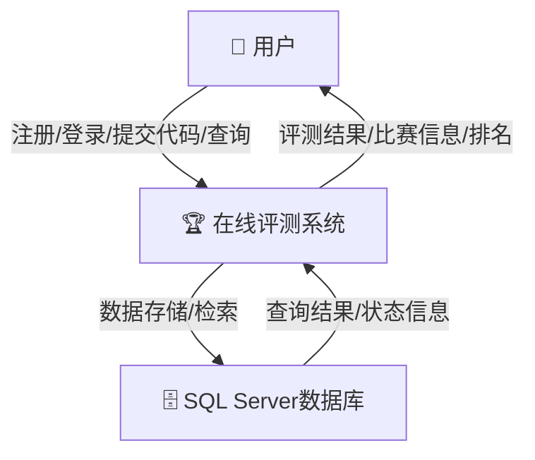
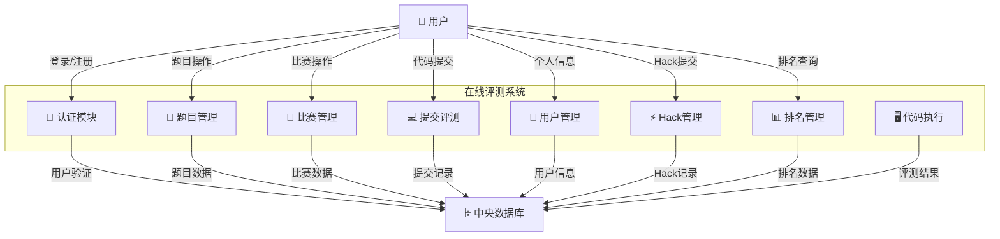
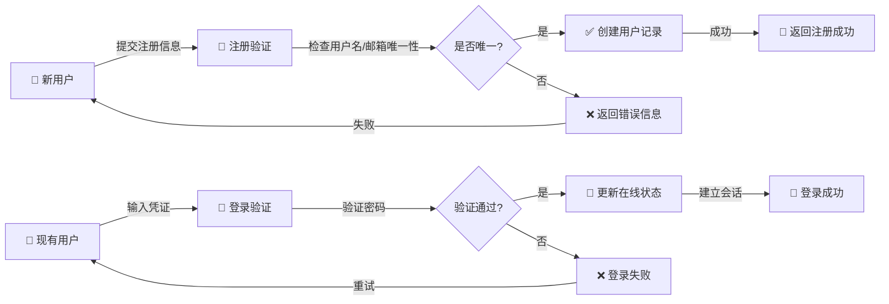
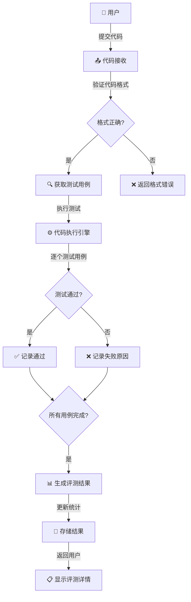
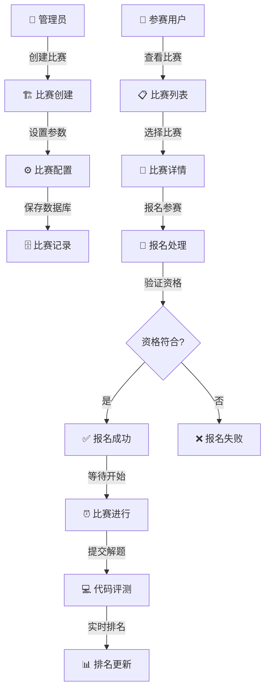
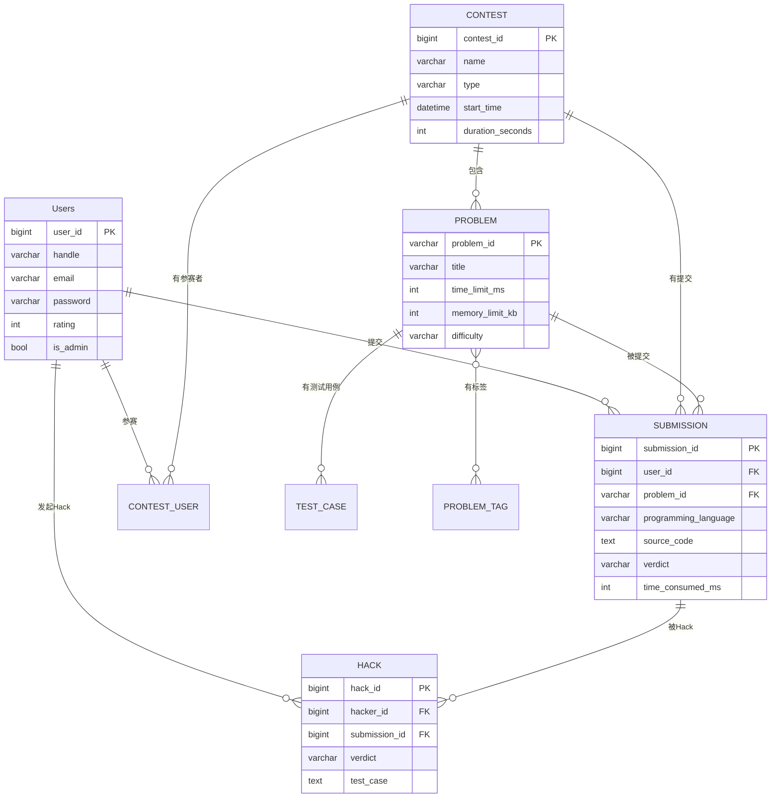
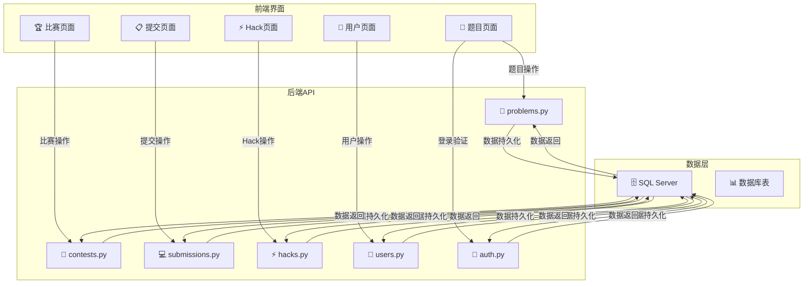

# 在线评测系统数据流图（DFD）

## 1. 上下文图（Level 0 DFD）

```mermaid
flowchart TD
    User[👤 用户]
    System[🏆 在线评测系统]
    Database[🗄️ SQL Server数据库]
    
    User -->|注册/登录/提交代码/查询| System
    System -->|评测结果/比赛信息/排名| User
    System -->|数据存储/检索| Database
    Database -->|查询结果/状态信息| System
```

## 2. 第一层DFD（Level 1 DFD）

```mermaid
flowchart TD
    User[👤 用户]
    
    subgraph System [在线评测系统]
        Auth[🔐 认证模块]
        Problem[📝 题目管理]
        Contest[🏅 比赛管理]
        Submit[💻 提交评测]
        UserMgr[👥 用户管理]
        HackMgr[⚡ Hack管理]
        RankMgr[📊 排名管理]
        Executor[🖥️ 代码执行]
    end
    
    DB[🗄️ 中央数据库]
    
    User -->|登录/注册| Auth
    User -->|题目操作| Problem
    User -->|比赛操作| Contest
    User -->|代码提交| Submit
    User -->|个人信息| UserMgr
    User -->|Hack提交| HackMgr
    User -->|排名查询| RankMgr
    
    Auth -->|用户验证| DB
    Problem -->|题目数据| DB
    Contest -->|比赛数据| DB
    Submit -->|提交记录| DB
    UserMgr -->|用户信息| DB
    HackMgr -->|Hack记录| DB
    RankMgr -->|排名数据| DB
    Executor -->|评测结果| DB
```

## 3. 核心业务流程DFD

### 3.1 用户注册登录流程

```mermaid
flowchart LR
    A[👤 新用户] -->|提交注册信息| B[🔐 注册验证]
    B -->|检查用户名/邮箱唯一性| C{是否唯一?}
    C -->|是| D[✅ 创建用户记录]
    C -->|否| E[❌ 返回错误信息]
    D -->|成功| F[📧 返回注册成功]
    E -->|失败| A
    
    G[👤 现有用户] -->|输入凭证| H[🔑 登录验证]
    H -->|验证密码| I{验证通过?}
    I -->|是| J[🔄 更新在线状态]
    I -->|否| K[❌ 登录失败]
    J -->|建立会话| L[🎉 登录成功]
    K -->|重试| G
```

### 3.2 代码提交评测流程

```mermaid
flowchart TD
    A[👤 用户] -->|提交代码| B[📤 代码接收]
    B -->|验证代码格式| C{格式正确?}
    C -->|是| D[🔍 获取测试用例]
    C -->|否| E[❌ 返回格式错误]
    
    D -->|执行测试| F[⚙️ 代码执行引擎]
    F -->|逐个测试用例| G{测试通过?}
    G -->|是| H[✅ 记录通过]
    G -->|否| I[❌ 记录失败原因]
    
    H --> J{所有用例完成?}
    I --> J
    J -->|是| K[📊 生成评测结果]
    K -->|更新统计| L[💾 存储结果]
    L -->|返回用户| M[📋 显示评测详情]
```

### 3.3 比赛管理流程

```mermaid
flowchart TB
    A[👤 管理员] -->|创建比赛| B[🏗️ 比赛创建]
    B -->|设置参数| C[⚙️ 比赛配置]
    C -->|保存数据库| D[🗄️ 比赛记录]
    
    E[👥 参赛用户] -->|查看比赛| F[📋 比赛列表]
    F -->|选择比赛| G[🎯 比赛详情]
    G -->|报名参赛| H[📝 报名处理]
    H -->|验证资格| I{资格符合?}
    I -->|是| J[✅ 报名成功]
    I -->|否| K[❌ 报名失败]
    
    J -->|等待开始| L[⏰ 比赛进行]
    L -->|提交解题| M[💻 代码评测]
    M -->|实时排名| N[📊 排名更新]
```

## 4. 数据存储关系图

```mermaid
erDiagram
    Users ||--o{ SUBMISSION : "提交"
    Users ||--o{ CONTEST_USER : "参赛"
    Users ||--o{ HACK : "发起Hack"
    
    CONTEST ||--o{ PROBLEM : "包含"
    CONTEST ||--o{ CONTEST_USER : "有参赛者"
    CONTEST ||--o{ SUBMISSION : "有提交"
    
    PROBLEM ||--o{ SUBMISSION : "被提交"
    PROBLEM ||--o{ TEST_CASE : "有测试用例"
    PROBLEM }o--o{ PROBLEM_TAG : "有标签"
    
    SUBMISSION ||--o{ HACK : "被Hack"
    
    Users {
        bigint user_id PK
        varchar handle
        varchar email
        varchar password
        int rating
        bool is_admin
    }
    
    CONTEST {
        bigint contest_id PK
        varchar name
        varchar type
        datetime start_time
        int duration_seconds
    }
    
    PROBLEM {
        varchar problem_id PK
        varchar title
        int time_limit_ms
        int memory_limit_kb
        varchar difficulty
    }
    
    SUBMISSION {
        bigint submission_id PK
        bigint user_id FK
        varchar problem_id FK
        varchar programming_language
        text source_code
        varchar verdict
        int time_consumed_ms
    }
    
    HACK {
        bigint hack_id PK
        bigint hacker_id FK
        bigint submission_id FK
        varchar verdict
        text test_case
    }
```

## 5. 系统模块交互图

```mermaid
flowchart TB
    subgraph Frontend [前端界面]
        A1[📄 题目页面]
        A2[🏆 比赛页面]
        A3[📋 提交页面]
        A4[⚡ Hack页面]
        A5[👥 用户页面]
    end
    
    subgraph Backend [后端API]
        B1[📝 problems.py]
        B2[🏅 contests.py]
        B3[💻 submissions.py]
        B4[⚡ hacks.py]
        B5[👥 users.py]
        B6[🔐 auth.py]
    end
    
    subgraph Database [数据层]
        C1[🗄️ SQL Server]
        C2[📊 数据库表]
    end
    
    A1 -->|题目操作| B1
    A2 -->|比赛操作| B2
    A3 -->|提交操作| B3
    A4 -->|Hack操作| B4
    A5 -->|用户操作| B5
    A1 -->|登录验证| B6
    
    B1 -->|数据持久化| C1
    B2 -->|数据持久化| C1
    B3 -->|数据持久化| C1
    B4 -->|数据持久化| C1
    B5 -->|数据持久化| C1
    B6 -->|数据持久化| C1
    
    C1 -->|数据返回| B1
    C1 -->|数据返回| B2
    C1 -->|数据返回| B3
    C1 -->|数据返回| B4
    C1 -->|数据返回| B5
    C1 -->|数据返回| B6
```
