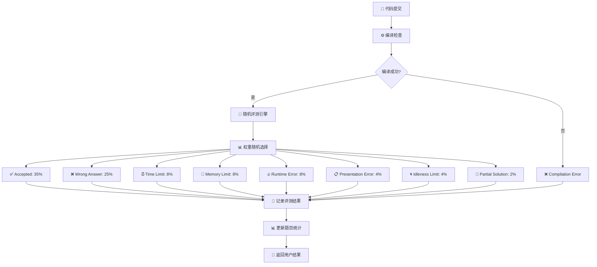
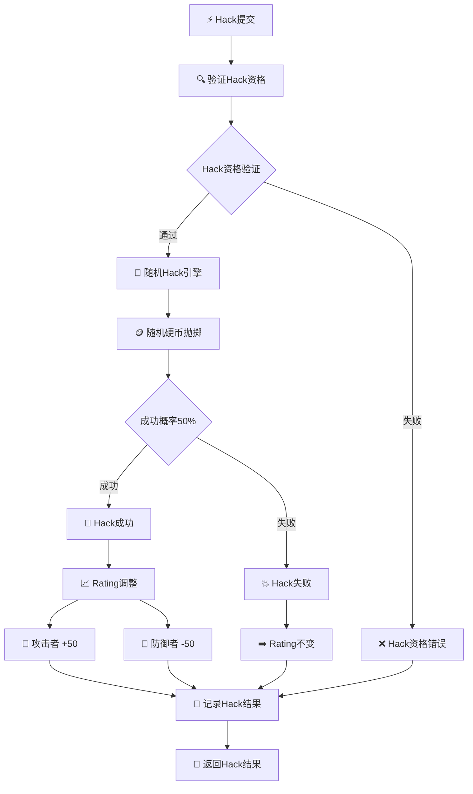
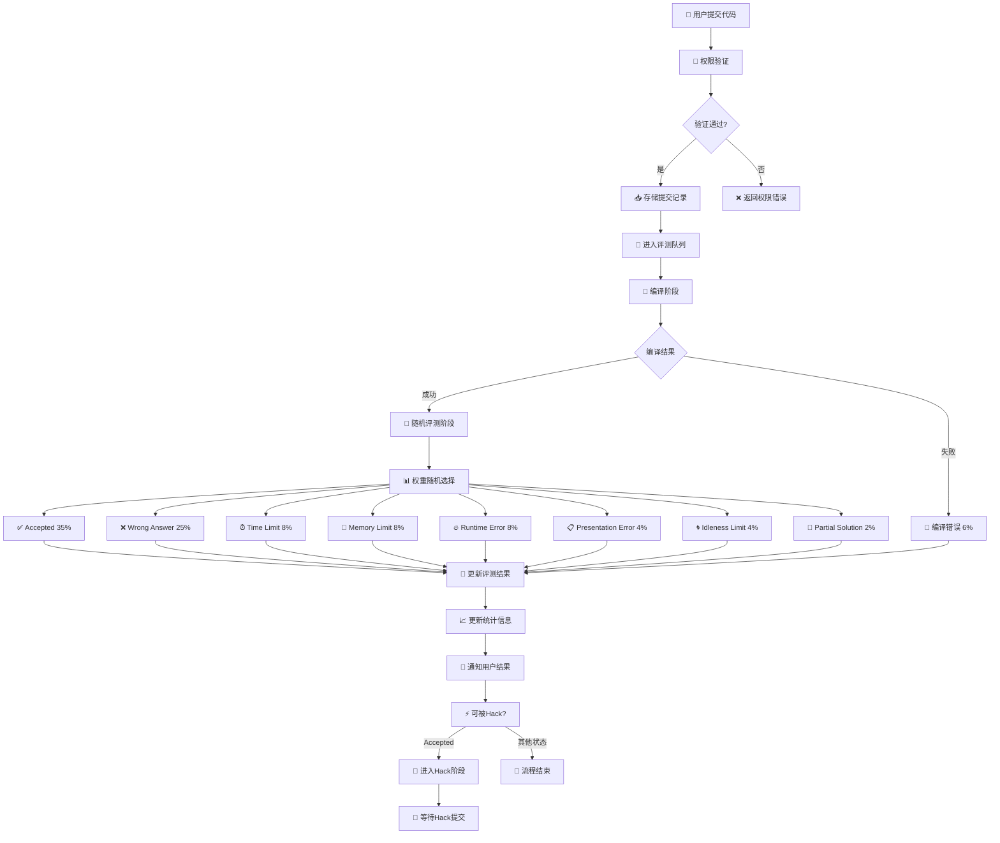
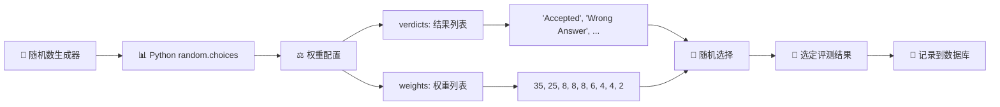
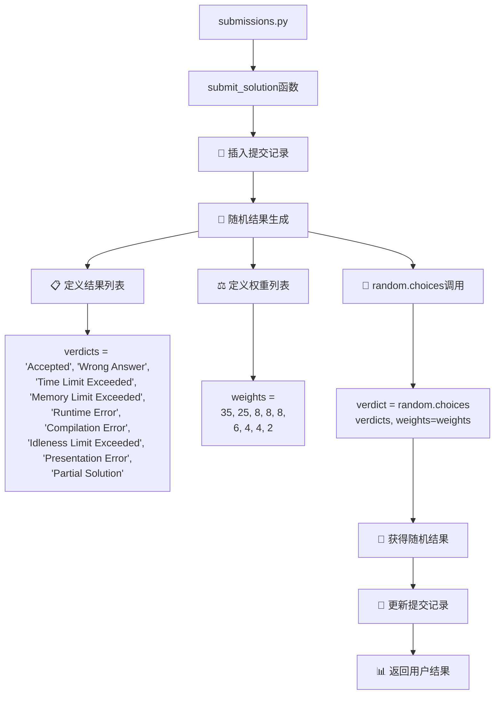
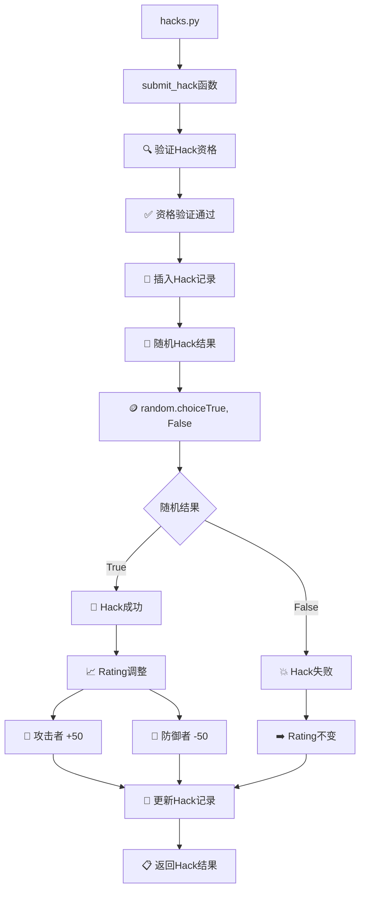
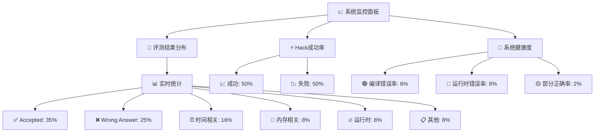

# 在线评测系统随机处理过程说明

## 1. 代码评测随机处理 - 判定表

### 1.1 随机评测结果判定表

### 1.2 随机评测权重配置表

| 评测结果 | 权重 | 概率 | 说明 |
|---------|------|------|------|
| **Accepted** | 35 | 35% | 代码完全正确 |
| **Wrong Answer** | 25 | 25% | 答案错误 |
| **Time Limit Exceeded** | 8 | 8% | 运行超时 |
| **Memory Limit Exceeded** | 8 | 8% | 内存超限 |
| **Runtime Error** | 8 | 8% | 运行时错误 |
| **Compilation Error** | 6 | 6% | 编译错误 |
| **Idleness Limit Exceeded** | 4 | 4% | 空闲超限 |
| **Presentation Error** | 4 | 4% | 输出格式错误 |
| **Partial Solution** | 2 | 2% | 部分正确 |

## 2. Hack随机处理 - 判定表

### 2.1 Hack随机结果判定表

### 2.2 Hack验证流程判定表

| 步骤 | 验证条件 | 失败动作 | 成功动作 |
|------|----------|----------|----------|
| 1 | 用户登录状态 | 返回"请先登录" | 继续验证 |
| 2 | 目标提交存在 | 返回"提交记录不存在" | 继续验证 |
| 3 | 目标提交状态为Accepted | 返回"只能Hack通过的提交" | 继续验证 |
| 4 | 非自己的提交 | 返回"不能Hack自己的提交" | 继续验证 |
| 5 | 未Hack过该提交 | 返回"已Hack过此提交" | 进入随机判定 |

## 3. 完整评测系统随机流程

### 3.1 完整随机评测系统

### 3.2 随机数生成逻辑

## 4. 随机处理代码实现

### 4.1 评测随机化代码流程

### 4.2 Hack随机化代码流程

## 5. 随机处理统计视图

### 5.1 系统随机分布监控

这些图表清晰地展示了系统中基于随机数的评测和Hack处理流程，包括权重配置、概率分布和完整的处理逻辑链。